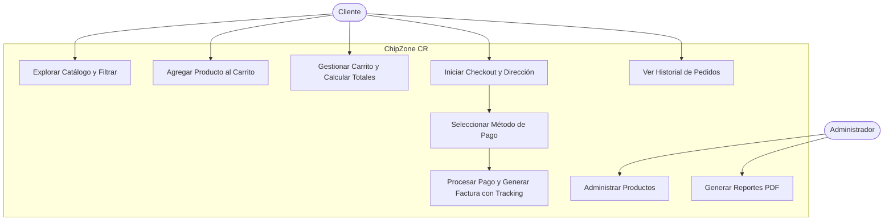

# ChipZone CR - Tienda Virtual

## Descripción del Proyecto
**ChipZone CR** es una plataforma de comercio electrónico de tecnología y dispositivos electrónicos desarrollada como Proyecto Final para el curso **Tecnologías y Sistemas Web II (ITI-523)** de la Universidad Técnica Nacional (UTN).

El sistema permite a los clientes registrarse, explorar un catálogo interactivo por categorías, buscar y filtrar por precio, gestionar su carrito de compras en tiempo real, procesar órdenes con pasarela de pagos simulada/Stripe, consultar su historial con número de seguimiento y generar reportes administrativos de ventas en formato PDF.

---

## Funcionalidades Principales

1. **Autenticación y Gestión de Usuarios:**
   - Registro de usuarios con validaciones de seguridad.
   - Inicio de sesión y cierre de sesión seguro mediante sesiones encriptadas y hashing de contraseñas.
   - Perfil de usuario con actualización de datos personales e historial detallado de pedidos.

2. **Catálogo de Productos:**
   - Categorización completa (Celulares, Laptops, Audio, Gaming, Accesorios).
   - Fichas técnicas con descripción, especificaciones, precio en colones (₡) e imágenes HD reales.
   - Búsqueda en tiempo real por nombre/descripción y filtrado por rango de precio (Min/Max).

3. **Carrito de Compras:**
   - Operaciones completas: agregar, actualizar cantidades y eliminar productos.
   - Cálculo automático del subtotal, IVA (13%) y costo de envío (con política de envío gratis sobre ₡50,000).

4. **Proceso de Compra (Checkout) y Facturación:**
   - Pasarela de pago con soporte para tarjeta de crédito y PayPal.
   - Generación de factura detallada con identificación de cliente, fecha, desglose de impuestos y número de seguimiento único (*Tracking Number*).

5. **Cookies de Productos Vistos Recientemente:**
   - Almacenamiento seguro en cookies del navegador para mostrar dinámicamente los últimos artículos visitados por el usuario.

6. **Panel Administrativo y Reportes PDF:**
   - Módulo administrativo para gestión de productos (CRUD).
   - Generación y descarga de reportes oficiales de ventas por mes y por cliente en PDF (usando DomPDF).

7. **Seguridad Integral:**
   - Protección contra inyecciones SQL mediante consultas preparadas en Eloquent ORM.
   - Protección contra ataques XSS con sanitización de Blade y tokens CSRF en todos los formularios.

---

## Tecnologías Utilizadas

- **Backend:** PHP 8.2+ con Framework Laravel 12
- **Base de Datos:** SQLite
- **Frontend:** HTML5, CSS3, JavaScript, Bootstrap 5 & Bootstrap Icons
- **Servidor Web:** Apache / PHP Built-in Server
- **Control de Versiones:** Git & GitHub

---

## Instrucciones de Instalación y Uso Local

1. **Requisitos Previos:**
   - PHP >= 8.2
   - Composer
   - Extensión SQLite habilitada en `php.ini`

2. **Clonar el Repositorio:**
   ```bash
   git clone https://github.com/Johan865/chipzone-cr.git
   cd chipzone-cr
   ```

3. **Instalar Dependencias de PHP:**
   ```bash
   composer install
   ```

4. **Configurar el Entorno:**
   ```bash
   copy .env.example .env
   php artisan key:generate
   ```

5. **Preparar Base de Datos y Datos de Prueba:**
   ```bash
   php artisan migrate:fresh --seed
   ```

6. **Iniciar el Servidor Web:**
   ```bash
   php artisan serve
   ```
   Abre tu navegador en: `http://127.0.0.1:8000`

---

## Cuentas de Acceso para Pruebas

| Rol | Correo Electrónico | Contraseña | Acceso |
| :--- | :--- | :--- | :--- |
| **Administrador** | `admin@chipzone.cr` | `password` | Catálogo + Panel `/admin/productos` y `/admin/reportes` |
| **Cliente** | `cliente@chipzone.cr` | `password` | Catálogo, Carrito, Checkout, Perfil y Pedidos |

---

## Ejecución de Pruebas Unitarias

Para verificar el correcto funcionamiento del sistema mediante la suite de tests automatizados:

```bash
php artisan test
```

Incluye pruebas unitarias para el cálculo de montos e impuestos del carrito (`CartServiceTest`) y pruebas de integración para autenticación, carrito y checkout (`CartTest`, `AuthTest`, `CheckoutTest`).

---

## Diagrama de Caso de Uso (Proceso de Compra)


